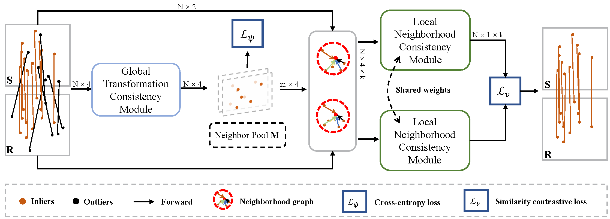

## GLoCNet:Robust Feature Matching with Global-local Consistency Network for Remote Sensing Image Registration, TGRS, 2023.
This is a code demo for the paper: [GLoCNet:Robust Feature Matching with Global-local Consistency Network for Remote Sensing Image Registration.](https://doi.org/10.1109/TGRS.2023.3321791)

<div align=center></div>


## References
If you find this code helpful, please kindly cite:
```
@ARTICLE{10271330,
  author={Liu, Yuyan and He, Wei and Zhang, Hongyan},
  journal={IEEE Transactions on Geoscience and Remote Sensing}, 
  title={GLoCNet: Robust Feature Matching With Global–Local Consistency Network for Remote Sensing Image Registration}, 
  year={2023},
  volume={61},
  number={},
  pages={1-13},
  doi={10.1109/TGRS.2023.3321791}}
```

Some of our reference projects are listed below, and we are very grateful for their research:
* [Dynamic Graph CNN for Learning on Point Clouds.](https://github.com/WangYueFt/dgcnn)
* [LMR: Learning A Two-class Classifier for Mismatch Removal.](https://github.com/StaRainJ/LMR)

## Requirements
The code is build on Pytorch 1.8 and cuda 11.1. Later version should also be compatible.


## Dataset
* You can download the SUIRD datasets at: https://github.com/yyangynu/SUIRD.
* You can download the MRSID datasets at: https://github.com/LJY-RS/RIFT-multimodal-image-matching.
* You can download the hyperspectral datasets at: https://github.com/YingJiacheng/UHIF-RIM.

## Run GloCNet demos
An example is given in `demo.py`.
1. download the models at here:链接：https://pan.baidu.com/s/1BQCP-MSu_zWlgmMmA61l0g 
提取码：12a6
2. run demo.py


